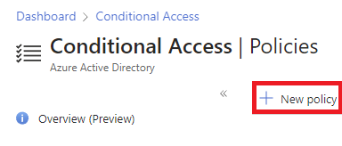
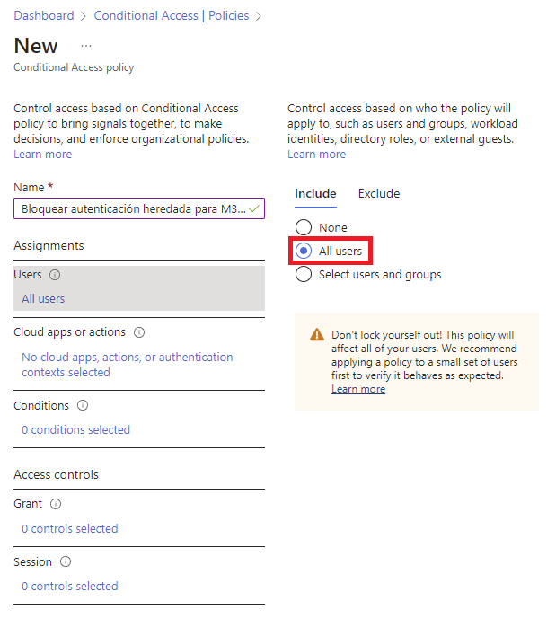
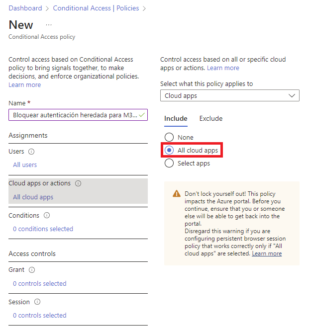
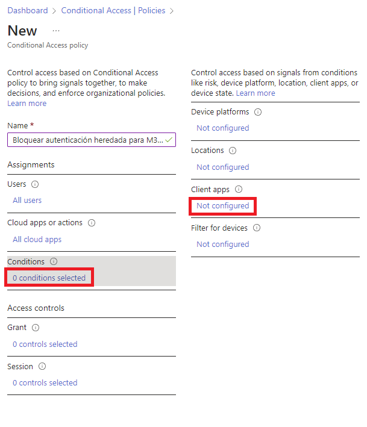
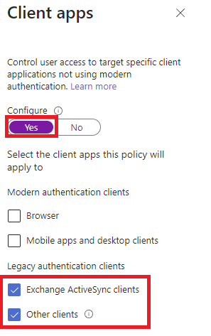
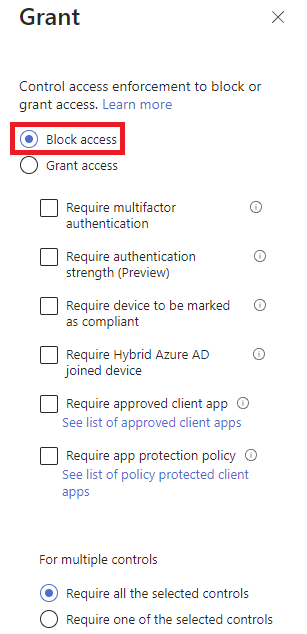
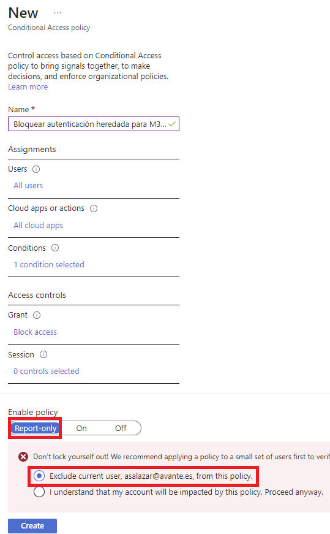

# Bloquear_Autenticacion_heredada

Creación de una directiva de acceso condicional para bloquear las solicitudes de autenticación heredadas. Esta directiva se coloca en modo de solo informe al principio, con el fin de que los administradores puedan determinar el impacto que tendrán en los usuarios existentes. Cuando los administradores se sientan cómodos con que la directiva se aplique según lo previsto, pueden cambiar a Activado o ensayar la implementación agregando grupos específicos y excluyendo otros.

Vamos a ***Acceso Condicional***

En ***Nombre*** ponemos ***Bloquear Autenticación heredada para M365***. El objetivo es que no se pueda usar app de Office <= 2010, ni protocolos inseguros como SMTP y POP3 con otros clientes de correo.

En ***Asignaciones***, hacemos clic en ***0 users and groups selected***

En ***Cloud apps or actions***, hacemos clic en ***No cloud apps, actions, or authentication contexts selected*** y seleccionamos ***All cloud apps***.

En ***Conditions*** hacemos clic en ***0 conditions selected***. Luego en ***Client apps*** hacemos clic en ***Not configured***.

En el panel que aparece a la derecha, marcamos ***Yes*** en ***Configure***. En ***Legacy authentication clients***, marcamos los dos checkbox. Hacemos clic en ***Done***.

En ***Access controls***, hacemos clic en ***0 controls selected*** en el apartado ***Grant***. En el panel derecho, seleccionamos ***Block access*** y hacemos clic en ***Select***.

Habilitamos la política en ***modo de auditoría***. Verificamos que todo vaya bien y en un par de días, la habilitamos quitando la exclusión para el usuario que la ha creado.

